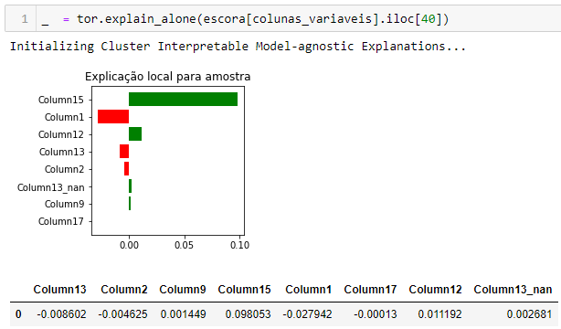

# Toranja Tabular.
## Explicabilidade para modelos que possuem muitas variáveis explicativas Missings.

O [Lime](https://github.com/marcotcr/lime) em sua essência é um excelente método para explicar modelos não lineares de forma simples e rápida, porém, é muito comum encontrar em bases produtivas variáveis explicativas ausentes, o tão chamados **Missings**. Neles, muitas vezes, podem conter informações discriminantes valiosas, nessas variáveis explicativas, quando utilizadas em nossos modelos, e portanto, essas variáveis normalmente não são tratadas ao serem modeladas, principalmente utilizando as mais novas ferramentas de boosting, como LightGBM ou CatBoost.
Infelizmente, ao utilizar o Lime, deve-se obrigatoriamente substituir todas os valores das variáveis **Missings** por algum número real, fazendo com que parte da explicabilida do modelo seja perdida, principalmente caso o valor **Missing** tenha algum valor altamente discriminativo em nossa base. Desta forma, neste projeto é apresentado o **Toranja Tabular**, uma revisão do Lime onde pode-se analisar modelos tenham como entrada essas variáveis sem que haja perda da explicabilidade do modelo. Nele, a explicabilidade dos **Missings** é mostrada em uma coluna apartada, para que possa ser devidamente analisado em cada caso.

Para utilizar a simples análise de explicabilidade deve-se seguir os seguintes passos:

```sh
from toranja import toranja
```
A seguir, deve-se colocar a base utilizada no desenvolvimento do modelo (com apenas as colunas que serão utilizadas na escoragem), o modelo(apenas funciona para modelos que possuam a função **predict_proba**), e as colunas categóricas, como índices, utilizadas no modelo (caso o modelo não tenha sido desenvolvido com Dummies/One Hot).

```sh
tor = toranja(df_desenvolvimento,modelo,cat_cols=[0,1,4,5])
```

Para a simples explicabilidade de uma amostra, devemos fazer o seguinte:

```sh
_  = tor.explain_alone(escora[colunas_variaveis].iloc[20])
```
Como resposta teremos algo como:



Nota-se, no exemplo acima, que o **Toranja Tabular** cria um novo valor terminado em **'_nan'** caso os **Missings** das variáveis explicativas tenham alta discriminação.
