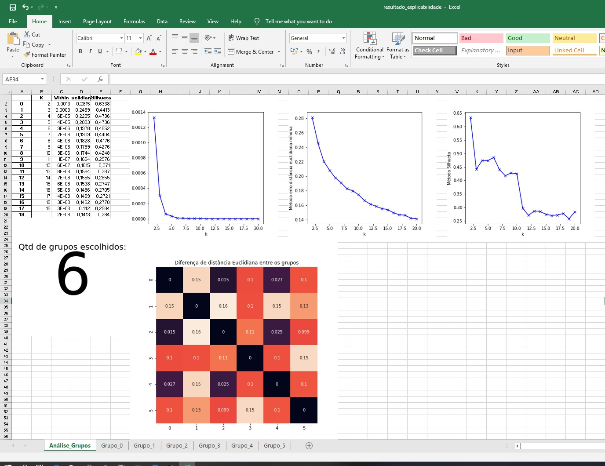

#  Tabular GrapeFruit - [Toranja Tabular] (https://github.com/ormenesse/Explicabilidade_Modelo_Tabular/blob/master/README.pt_br.md)
## Explanability for models that have many explanatory variables with missing values.


[Lime] (https://github.com/marcotcr/lime) is in its essence an excellent method for explaining nonlinear models simply and quickly, but it is very common to find in productive bases explanatory variables containing **Missings** values. These missing values, can often discriminate information valuable information when used in machine learning models, and therefore when modeled these values are usually not handled in any special way, especially using the latest boosting tools such as LightGBM or CatBoost.
Unfortunately, when using Lime, it is mandatory to replace all **Missings** values with some real number (zero, average, median, etc.), causing some of the model's explainability to be lost, especially if the **Missing** value has some valuable information in it. Thus, the **Tabular Grapefruit** is a Lime revision, where it is possible to analyze models that have as input these (explanatory) variables without losing the explicability of the model. In it, the explainability of the **Missings** is shown in a separate column, which allows for proper individual analysis of the cases.

To use a simple explicability analysis, as in Lime, follow these steps:

```python
from toranja import toranja
```

Next, you must place the base used in the development of the model (with only the columns that will be used in the scoring), the model (only works for models that have the function **predict_proba**), and the categorical columns, such as indexes used in the model (if the model was not developed with Dummies / One Hot).

```python
tor = toranja(df_desenvolvimento,modelo,cat_cols=[0,1,4,5])
```

For the simple explicability of a sample, we must do the following:

```python
_  = tor.explain_alone(df_desenvolvimento.iloc[20])
```

You will have something like:


Note in the example above that the **Tabular Grapefruit** creates a new value ending in **'_nan'** if the **Missings** of the explanatory variables have high discrimination.

## Creating Explanability Groups

It is common for a complete analysis of a model to usually take many hours, and if analyzes need to be done recurrently, it is common that there is no prompt response. Thus **Grapefruit** provides, with explanatory grouping techniques, a simple way to analyze a possible explanation of the model response without having all the analysis completed. The grouping will be part of the class created for model explainability and an Excel report will be issued:

```python
tor.tabular_analysis(df_desenvolvimento,sample_base=1)
```
In the figures below we can see how the explicability analysis would look:




